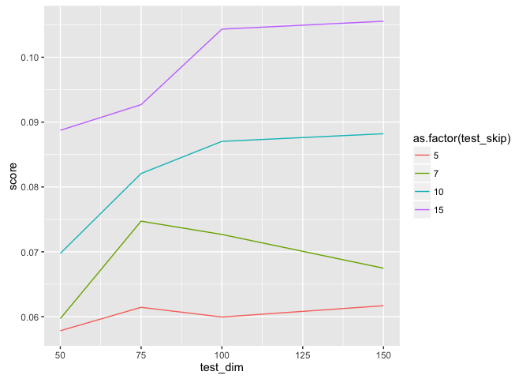

Tuning
================

This file experiments with tuning options for the GloVe model, by looking at how the tuning values impact the measurable test scores and the qualitative success of the outlier detection and sentence replacement.

Options will include:

-   Adjusting the number of dimensions
-   Adjusting the skip window
-   Adjusting the regularisation parameter
-   Adding a "standard" corpus to the training of the GloVe model to account for previously unseen words.

Setup
-----

``` r
set.seed(2016L)
library(dplyr)
library(ggplot2)
library(magrittr)
library(stringr)
library(text2vec)
library(tibble)
library(tidytext)
```

### Data Import

``` r
ref <- readRDS("~/ref_data.rds") %>% 
  select(CaseStudyId, UOA, ImpactType, Institution, Title, ImpactDetails)
in_test <- sample(1:nrow(ref), 10)
test <- ref[ in_test, ] # Leave 10 out for testing
ref  <- ref[-in_test, ] # Keep the rest
ref$Institution %<>%   str_replace_all("\\s+", " ") %>% 
                       str_replace_all("(^\\s+)|(\\s+$)", "")
ref$Title %<>%         str_replace_all("\\s+", " ") %>% 
                       str_replace_all("(^\\s+)|(\\s+$)", "")
ref$ImpactDetails %<>% str_replace_all("\\s+", " ") %>% 
                       str_replace_all("(^\\s+)|(\\s+$)", "")
tidy_ref <- unnest_tokens(ref, Sentence, ImpactDetails, "sentences", to_lower=F)
```

Dimensionality and Skip Window
------------------------------

This will experiment with the impact of dimensionality and skip-window size on the results of the fixed training tests, and the ability to detect known "bad" sentences from unseen documents.

``` r
source("~/impactface/Functions/fit_glove_model.R")
questions_file <- '~/impactface/Data/questions-words.txt'
test_dim <- c(50, 75, 100, 150)
test_skip <- c(5L, 7L, 10L, 15L)
results <- data.frame(
  test_dim = c(rep(50,4),rep(75,4),rep(100,4),rep(150,4)),
  test_skip = rep(test_skip, 4),
  score = NA
)
for (i in seq_along(test_dim)) {
  for (j in seq_along(test_skip)) {
    tmp <- fit_glove_model(ref$ImpactDetails, test_dim[i], test_skip[j])
    glove <- tmp[[1]]
    vocab <- tmp[[2]]
    rm(tmp)
    word_vectors <- glove$get_word_vectors()
    qlst <- prepare_analogy_questions(questions_file,
                                      rownames(word_vectors),
                                      verbose = F)
    res <- check_analogy_accuracy(questions_list = qlst, 
                                  m_word_vectors = word_vectors,
                                  verbose = F) %>% 
      mutate(result = (predicted == actual)) %>% 
      count(result)
    results$score[which(results$test_dim == test_dim[i] & results$test_skip == test_skip[j])] <- 
      res$n[which(res$result)]/res$n[which(!res$result)]
  }
}
results$test_skip <- as.factor(results$test_skip)
ggplot(results) +
  geom_line(aes(x=test_dim, y=score, col=as.factor(test_skip)))
```


